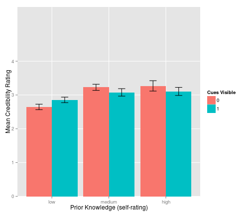

Social QA Credibility Study
========================================================

### Summary of study participants
<!-- html table generated in R 3.0.2 by xtable 1.7-1 package -->
<!-- Sun Dec 22 11:59:52 2013 -->
<TABLE border=1>
<TR> <TH>  </TH> <TH> Condition </TH> <TH> Undergraduate Computing and Information Science </TH> <TH> Postgraduate Information Science </TH> <TH> Undergraduate Philosophy </TH>  </TR>
  <TR> <TD align="right"> 1 </TD> <TD> Subjects </TD> <TD align="right">  29 </TD> <TD align="right">  11 </TD> <TD align="right">  13 </TD> </TR>
  <TR> <TD align="right"> 2 </TD> <TD> Questions presented </TD> <TD align="right">  16 </TD> <TD align="right">   5 </TD> <TD align="right">   5 </TD> </TR>
  <TR> <TD align="right"> 3 </TD> <TD> Rated answers (cues visible) </TD> <TD align="right"> 294 </TD> <TD align="right">  63 </TD> <TD align="right">  75 </TD> </TR>
  <TR> <TD align="right"> 4 </TD> <TD> Rated answers (cues not visible) </TD> <TD align="right"> 243 </TD> <TD align="right">  66 </TD> <TD align="right"> 114 </TD> </TR>
   </TABLE>

### Correlations
Table: Correlation betwen user credibility rating and community score, by test group
<!-- html table generated in R 3.0.2 by xtable 1.7-1 package -->
<!-- Sun Dec 22 11:59:52 2013 -->
<TABLE border=1>
<TR> <TH>  </TH> <TH> Cues Not Shown </TH> <TH> Cues Shown </TH>  </TR>
  <TR> <TD align="right"> UG Comp/IS </TD> <TD> 0.17 (0.001) </TD> <TD> 0.273 (0.000) </TD> </TR>
  <TR> <TD align="right"> PG IS </TD> <TD> 0.196 (0.054) </TD> <TD> 0.218 (0.052) </TD> </TR>
  <TR> <TD align="right"> UG Phil </TD> <TD> 0.132 (0.078) </TD> <TD> 0.294 (0.002) </TD> </TR>
  <TR> <TD align="right"> Overall </TD> <TD> 0.137 (0.000) </TD> <TD> 0.284 (0.000) </TD> </TR>
   </TABLE>

Table: Correlation between user credibility rating and answerer's reputation, by test group
<!-- html table generated in R 3.0.2 by xtable 1.7-1 package -->
<!-- Sun Dec 22 11:59:53 2013 -->
<TABLE border=1>
<TR> <TH>  </TH> <TH> Cues Not Shown </TH> <TH> Cues Shown </TH>  </TR>
  <TR> <TD align="right"> UG Comp/IS </TD> <TD> 0.125 (0.010) </TD> <TD> 0.152 (0.000) </TD> </TR>
  <TR> <TD align="right"> PG IS </TD> <TD> -0.051 (0.599) </TD> <TD> 0.264 (0.015) </TD> </TR>
  <TR> <TD align="right"> UG Phil </TD> <TD> 0.176 (0.016) </TD> <TD> 0.303 (0.001) </TD> </TR>
  <TR> <TD align="right"> Overall </TD> <TD> 0.058 (0.112) </TD> <TD> 0.172 (0.000) </TD> </TR>
   </TABLE>

Table: Correlation between user credibility rating and answerer's reputation, by prior knowledge
<!-- html table generated in R 3.0.2 by xtable 1.7-1 package -->
<!-- Sun Dec 22 11:59:53 2013 -->
<TABLE border=1>
<TR> <TH>  </TH> <TH> Cues Not Shown </TH> <TH> Cues Shown </TH>  </TR>
  <TR> <TD align="right"> Low </TD> <TD> 0.087 (0.115) </TD> <TD> 0.28 (0.000) </TD> </TR>
  <TR> <TD align="right"> Medium </TD> <TD> 0.198 (0.003) </TD> <TD> 0.31 (0.000) </TD> </TR>
  <TR> <TD align="right"> High </TD> <TD> 0.248 (0.005) </TD> <TD> 0.3 (0.000) </TD> </TR>
   </TABLE>

Table: Correlation between user credibility rating and answerer's reputation, by prior knowledge
<!-- html table generated in R 3.0.2 by xtable 1.7-1 package -->
<!-- Sun Dec 22 11:59:53 2013 -->
<TABLE border=1>
<TR> <TH>  </TH> <TH> Cues Not Shown </TH> <TH> Cues Shown </TH>  </TR>
  <TR> <TD align="right"> Low </TD> <TD> 0.076 (0.162) </TD> <TD> 0.182 (0.001) </TD> </TR>
  <TR> <TD align="right"> Medium </TD> <TD> -0.065 (0.309) </TD> <TD> 0.208 (0.003) </TD> </TR>
  <TR> <TD align="right"> High </TD> <TD> 0.204 (0.017) </TD> <TD> 0.128 (0.057) </TD> </TR>
   </TABLE>

Figure: Prior knowledge and confidence
 

### Comment classification according to persuasiveness score - UG
<!-- html table generated in R 3.0.2 by xtable 1.7-1 package -->
<!-- Sun Dec 22 11:59:54 2013 -->
<TABLE border=1>
<TR> <TH>  </TH> <TH> low </TH> <TH> medium </TH> <TH> high </TH>  </TR>
  <TR> <TD align="right"> 1 </TD> <TD> argument against answer (17) </TD> <TD> unable to say why! (8) </TD> <TD> argument for answer (13) </TD> </TR>
  <TR> <TD align="right"> 2 </TD> <TD> incomplete explanation / lacking detail (11) </TD> <TD> incomplete explanation / lacking detail (7) </TD> <TD> coherence (10) </TD> </TR>
  <TR> <TD align="right"> 3 </TD> <TD> lack of clarity (7) </TD> <TD> clarity (5) </TD> <TD> accuracy / completeness (7) </TD> </TR>
  <TR> <TD align="right"> 4 </TD> <TD> unable to say why! (7) </TD> <TD> lack of detail (5) </TD> <TD> multiple explanations (7) </TD> </TR>
  <TR> <TD align="right"> 5 </TD> <TD> over-complexity (6) </TD> <TD> argument against answer (4) </TD> <TD> clarity (6) </TD> </TR>
  <TR> <TD align="right"> 6 </TD> <TD> lack of knowledge of subject (5) </TD> <TD> coherence (3) </TD> <TD> examples offered (6) </TD> </TR>
  <TR> <TD align="right"> 7 </TD> <TD> tangential/does not answer question (5) </TD> <TD> external references provided (3) </TD> <TD> simplicity (5) </TD> </TR>
  <TR> <TD align="right"> 8 </TD> <TD> doesnt fit preconception /  prior experience (4) </TD> <TD> undecided (3) </TD> <TD> comparative (4) </TD> </TR>
  <TR> <TD align="right"> 9 </TD> <TD> lack of detail (4) </TD> <TD> argument for answer (2) </TD> <TD> fits preconception / prior experience (4) </TD> </TR>
  <TR> <TD align="right"> 10 </TD> <TD> lack of examples (3) </TD> <TD> comparative (2) </TD> <TD> succinct (4) </TD> </TR>
   </TABLE>

### Comment classification according to persuasiveness score - PG
<!-- html table generated in R 3.0.2 by xtable 1.7-1 package -->
<!-- Sun Dec 22 11:59:55 2013 -->
<TABLE border=1>
<TR> <TH>  </TH> <TH> low </TH> <TH> medium </TH> <TH> high </TH>  </TR>
  <TR> <TD align="right"> 1 </TD> <TD> argument against answer (7) </TD> <TD> argument against answer (4) </TD> <TD> argument for answer (8) </TD> </TR>
  <TR> <TD align="right"> 2 </TD> <TD> opinion based (4) </TD> <TD> argument for answer (4) </TD> <TD> coherence (5) </TD> </TR>
  <TR> <TD align="right"> 3 </TD> <TD> incomplete explanation / lacking detail (2) </TD> <TD> lack of knowledge of subject (3) </TD> <TD> experience of answerer (4) </TD> </TR>
  <TR> <TD align="right"> 4 </TD> <TD> accuracy / completeness (1) </TD> <TD> coherence (2) </TD> <TD> practicality (4) </TD> </TR>
  <TR> <TD align="right"> 5 </TD> <TD> lack of detail (1) </TD> <TD> incomplete explanation / lacking detail (2) </TD> <TD> fits preconception / prior experience (3) </TD> </TR>
  <TR> <TD align="right"> 6 </TD> <TD> succinct (1) </TD> <TD> tangential/does not answer question (2) </TD> <TD> accuracy / completeness (2) </TD> </TR>
  <TR> <TD align="right"> 7 </TD> <TD> tangential/does not answer question (1) </TD> <TD> accuracy / completeness (1) </TD> <TD> examples offered (2) </TD> </TR>
  <TR> <TD align="right"> 8 </TD> <TD>  </TD> <TD> clarity (1) </TD> <TD> incomplete explanation / lacking detail (2) </TD> </TR>
  <TR> <TD align="right"> 9 </TD> <TD>  </TD> <TD> lack of confidence (1) </TD> <TD> sympathise (2) </TD> </TR>
  <TR> <TD align="right"> 10 </TD> <TD>  </TD> <TD> lack of detail (1) </TD> <TD> clarity (1) </TD> </TR>
   </TABLE>

### Comment classification according to persuasiveness score - Phil
<!-- html table generated in R 3.0.2 by xtable 1.7-1 package -->
<!-- Sun Dec 22 11:59:55 2013 -->
<TABLE border=1>
<TR> <TH>  </TH> <TH> low </TH> <TH> medium </TH> <TH> high </TH>  </TR>
  <TR> <TD align="right"> 1 </TD> <TD> argument against answer (28) </TD> <TD> argument against answer (8) </TD> <TD> argument for answer (32) </TD> </TR>
  <TR> <TD align="right"> 2 </TD> <TD> tangential/does not answer question (10) </TD> <TD> incomplete explanation / lacking detail (4) </TD> <TD> accuracy / completeness (4) </TD> </TR>
  <TR> <TD align="right"> 3 </TD> <TD> lack of clarity (3) </TD> <TD> argument for answer (2) </TD> <TD> succinct (4) </TD> </TR>
  <TR> <TD align="right"> 4 </TD> <TD> lack of detail (3) </TD> <TD> lack of detail (2) </TD> <TD> coherence (2) </TD> </TR>
  <TR> <TD align="right"> 5 </TD> <TD> incomplete explanation / lacking detail (2) </TD> <TD> coherence (1) </TD> <TD> answer presentation (1) </TD> </TR>
  <TR> <TD align="right"> 6 </TD> <TD> lack of answerer understanding (1) </TD> <TD> examples offered (1) </TD> <TD> clarity (1) </TD> </TR>
  <TR> <TD align="right"> 7 </TD> <TD> low quality of answer (1) </TD> <TD>  </TD> <TD> comparative (1) </TD> </TR>
  <TR> <TD align="right"> 8 </TD> <TD> overlong (1) </TD> <TD>  </TD> <TD> examples offered (1) </TD> </TR>
  <TR> <TD align="right"> 9 </TD> <TD> superficial (1) </TD> <TD>  </TD> <TD> incomplete explanation / lacking detail (1) </TD> </TR>
  <TR> <TD align="right"> 10 </TD> <TD>  </TD> <TD>  </TD> <TD> too informal (1) </TD> </TR>
   </TABLE>
